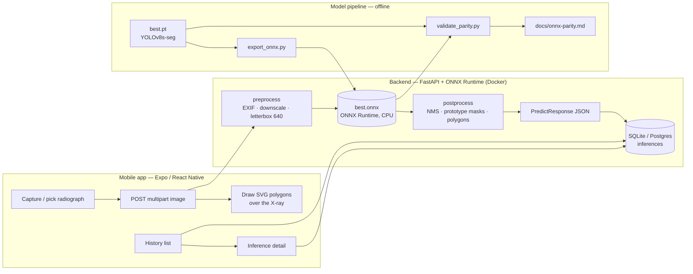

# Architecture

OrthoVision AI turns an academic YOLOv8s-seg model into a small production
system: an Expo mobile client, a torch-free FastAPI inference server, and a
reproducible model-export/validation pipeline.

## Components

### Model pipeline (`model/`)
Runs once, offline, with torch + ultralytics. `export_onnx.py` produces
`best.onnx` (opset 12, static 1×3×640×640). `validate_parity.py` runs both the
original `.pt` model and the production ONNX path over the held-out test set
and writes [onnx-parity.md](onnx-parity.md). Crucially, the ONNX side of the
validator imports the *actual backend code* (`backend/app/inference`), so the
report certifies exactly what ships — not a re-implementation.

### Backend (`backend/`)
FastAPI serving four endpoints (see [api-contract.md](api-contract.md)).
Deliberately **torch-free**: the YOLOv8-seg post-processing (NMS, prototype
mask assembly, polygonization) is re-implemented in numpy + OpenCV, so the
Docker image is ~300 MB instead of >2 GB and fits Render's free tier.

Request flow for `POST /v1/predict`:
1. **preprocess** — decode bytes, apply EXIF orientation, downscale if the
   longest side exceeds 4096 px, letterbox to 640×640, normalize to NCHW float.
2. **inference** — a single shared `onnxruntime.InferenceSession` (created at
   startup, thread-safe for `run()`).
3. **postprocess** — confidence filter → class-aware NMS → `sigmoid(coeffs @
   prototypes)` → crop to box → **remove letterbox padding before resizing to
   the original resolution** (a correctness improvement over the notebook,
   which resized the padded mask directly) → binarize → `findContours` +
   `approxPolyDP` into normalized polygon rings.
4. **persist** — store the detection payload, timings, and a ≤160 px JPEG
   thumbnail in the `inferences` table. The full radiograph is never stored.

The prediction route is a sync `def`, so FastAPI runs it in a threadpool and
CPU-bound inference never blocks the event loop.

### Mobile (`mobile/`)
Expo Router app (TypeScript). `src/api/client.ts` mirrors the backend contract
and auto-resolves the backend URL from the Metro host in dev (so a physical
phone on the same Wi-Fi just works) or from `expo.extra.apiUrl` in production.
`MaskOverlay` scales the normalized polygons to the rendered image box and
draws them with `react-native-svg`. The visual language leans on native Liquid
Glass (`expo-glass-effect`) on iOS 26+, with graceful fallbacks to `BlurView`
and bordered surfaces elsewhere.

## Key decisions

| Decision | Why |
|---|---|
| Monorepo | One portfolio narrative (model → API → app); the API contract evolves atomically across backend and client. |
| Server-side inference | Health domain: control the model version, log every inference, stay independent of phone hardware. |
| ONNX Runtime, no torch in prod | ~300 MB image vs >2 GB; fits a 512 MB free-tier instance. The hand-written decode is itself portfolio signal. |
| Normalized coordinates `[0,1]` | The client scales to any render size; the model's internal 640 space never leaks out. |
| Polygons, not raster masks | Response < 30 KB; SVG draws crisply at any resolution. |
| Thumbnail-only persistence | Visual history without storing sensitive full radiographs. |
| SQLite (dev) → Postgres (prod) | Render's filesystem is ephemeral; SQLite would lose history on every deploy. |

## Known limitations
- **Open input domain** — a non-radiograph photo can still elicit spurious
  detections. Mitigated by the 0.5 threshold and the in-app disclaimer;
  out-of-distribution rejection is future work.
- **CPU latency** — ~0.4–0.9 s/image on Render CPU vs ~16 ms on the training
  GPU. Surfaced honestly via `timing_ms` and a scan animation.
- **Mask holes** — `RETR_EXTERNAL` ignores interior holes, acceptable for a
  translucent overlay.
